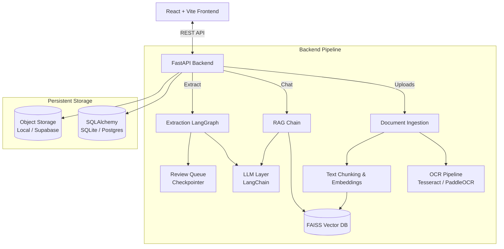

<div align="center">

# AI Copilot 🤖📄

**An AI-powered Document Intelligence Platform**

[](https://www.python.org/downloads/)
[](https://fastapi.tiangolo.com)
[](https://react.dev)

</div>

AI Copilot is an advanced, multi-modal Retrieval-Augmented Generation (RAG) system that allows users to upload documents, chat with them using conversational AI, and extract structured data using a human-in-the-loop review queue. 

Built with LangChain and LangGraph, it supports **9 LLM providers** (including local offline models via Ollama) and **4 local OCR engines** for maximum privacy and flexibility.

---

## ✨ Key Features

### 📄 Document Intelligence
* **Multi-Format Support**: Upload PDF, DOCX, TXT, or import directly from public URLs.
* **Smart Parsing & OCR**: Automatically detect image-heavy PDFs and route them through local OCR engines (Tesseract, PaddleOCR, DocTR, TrOCR) to extract text from scans.
* **Semantic Vector Search**: High-performance local embeddings using `BAAI/bge-large-en-v1.5` and FAISS vector storage.

### 🤖 RAG Conversational Q&A
* **Context-Aware Chat**: Ask questions scoped to a specific document or across your entire workspace.
* **Memory & Citations**: Multi-turn chat memory that resolves conversational references (e.g., "what does it mean by that?"), backed by precise source document citations.

### 🔍 Structured Field Extraction
* **LangGraph Extraction**: Define custom JSON schemas (e.g., "Invoice Number", "Total Amount") and extract them from unstructured text.
* **Confidence Scoring & Auto-Retries**: LLM outputs are validated. If the model fails to return valid JSON, the graph automatically retries with strict prompting.

### ✅ Human-in-the-Loop Review
* **Review Queue**: Extracted fields with a confidence score below 70% trigger a LangGraph interrupt.
* **Stateful Pausing**: The system pauses execution, saving state to SQLite. A human operator reviews, corrects, and approves the data in the UI, resuming the graph.
* **Data Export**: Export finalized extraction data to CSV or XLSX.

### 🔌 Multi-Provider LLM Support
Switch between providers via the `.env` file or dynamically in the UI without changing any code:
* **Local / Private**: Ollama (Llama 3, Qwen, etc.)
* **Free / Trial APIs**: Groq, Gemini, Together AI, Mistral, Cohere, HuggingFace
* **Enterprise APIs**: Anthropic (Claude), OpenAI (GPT-4)

---

## 🏗️ Architecture



### Tech Stack
| Component | Technologies |
|-----------|-------------|
| **Frontend** | React 19, Vite, Tailwind CSS, React Router |
| **Backend** | FastAPI, Uvicorn, SQLAlchemy |
| **AI / NLP** | LangChain, LangGraph, sentence-transformers |
| **Data Storage** | FAISS (vectors), SQLite/Postgres (relational) |


## 🚀 Getting Started

### Prerequisites
* Python 3.11+
* Node.js 18+
* *(Optional)* Ollama installed for local LLM inference.

### 1. Backend Setup

```bash
# Clone the repository
git clone https://github.com/sudeepsinghal/AI-copilot.git
cd AI-copilot

# Create a virtual environment
python3 -m venv venv
source venv/bin/activate

# Install dependencies (this may take a few minutes for PyTorch/Transformers)
pip install -r requirements.txt

# Set up environment variables
cp .env.example .env
# Edit .env to add your preferred API keys (e.g., GROQ_API_KEY)

# Run the backend server
uvicorn Backend.main:app --reload
```
The API will be available at `http://localhost:8000` with Swagger documentation at `http://localhost:8000/docs`.

### 2. Frontend Setup

In a new terminal window:
```bash
cd frontend

# Install dependencies
npm install

# Set up environment variables
cp .env.example .env

# Start the dev server
npm run dev
```
The UI will be available at `http://localhost:5173`.

---

## ⚙️ Environment Variables

Refer to `.env.example` for the complete list. Key configuration options:

| Variable | Default | Description |
|----------|---------|-------------|
| `LLM_PROVIDER` | `groq` | Choose from: `groq`, `gemini`, `anthropic`, `openai`, `ollama`, etc. |
| `EMBEDDING_PROVIDER` | `local` | `local`, `gemini`, or `ollama`. |
| `DATABASE_URL` | *(local sqlite)* | Set to a Postgres connection string for production deployment. |
| `SUPABASE_URL` | *(local storage)* | Set along with `SUPABASE_SERVICE_KEY` to enable cloud object storage. |
| `AUTH_ENABLED` | `false` | Set to `true` to enable Firebase Auth token verification. |

---

## 📚 API Reference (Core Endpoints)

| Method | Endpoint | Description |
|--------|----------|-------------|
| `GET`  | `/providers` | Returns configuration status for all LLM providers and local OCR engines. |
| `POST` | `/upload` | Uploads, parses, chunks, embeds, and stores a document. |
| `POST` | `/import-url` | Downloads and ingests a document from a public URL. |
| `POST` | `/ask` | Semantic RAG search across documents with conversation memory. |
| `POST` | `/extract` | Starts a structured field extraction job via LangGraph. |
| `POST` | `/review/start` | Evaluates extraction confidence and pauses for human review if needed. |
| `POST` | `/review/approve` | Resumes the LangGraph workflow with human-corrected data. |
| `POST` | `/extractions/export` | Downloads extraction results as CSV or XLSX. |

---

## 🤝 Contributing

We welcome contributions! Please see [CONTRIBUTING.md](CONTRIBUTING.md) for details on how to set up the development environment, add new LLM providers, or integrate additional OCR engines.

---

## 📄 Credits

**Author:** Sudeep Singhal  
**LinkedIn:** [Sudeep Singhal](https://www.linkedin.com/in/sudeepsinghal/)